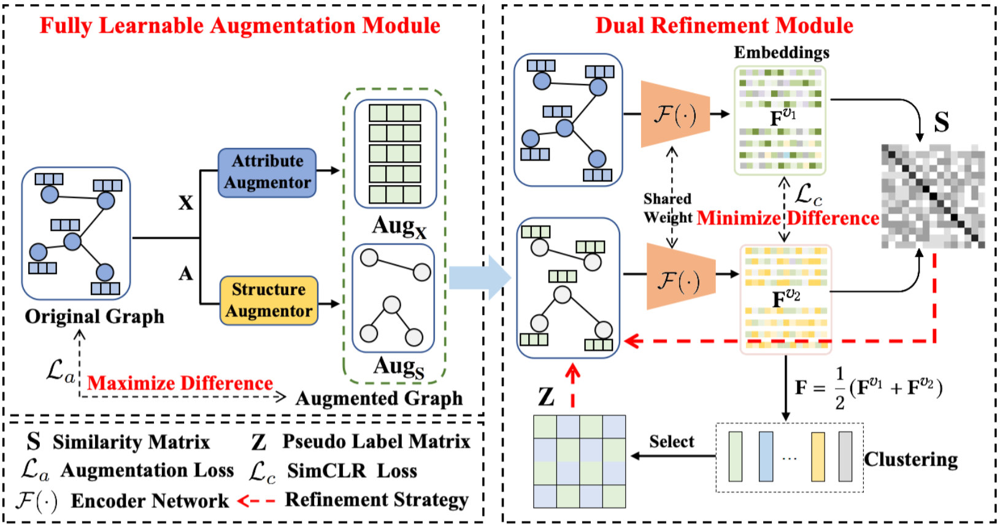

[stars-img]: https://img.shields.io/github/stars/xihongyang1999/GraphLearner?color=yellow
[stars-url]: https://github.com/xihongyang1999/GraphLearner/stargazers
[fork-img]: https://img.shields.io/github/forks/xihongyang1999/GraphLearner?color=lightblue&label=fork
[fork-url]: https://github.com/xihongyang1999/GraphLearner/network/members
[visitors-img]: https://visitor-badge.glitch.me/badge?page_id=xihongyang.1999.GraphLearner/
[adgc-url]: https://github.com/xihongyang1999/GraphLearner

# CONVERT:Contrastive Graph Clustering with Reliable Augmentation

<p align="center">   
    <a href="https://pytorch.org/" alt="PyTorch">
      </a>
    <a href="https://www.acmmm2024.org" alt="Conference">
        </a>
<p/>


[![GitHub stars][stars-img]][stars-url]
[![GitHub forks][fork-img]][fork-url]
[![visitors][visitors-img]][adgc-url]


An official source code for paper CONVERT:Contrastive Graph Clustering with Reliable Augmentation, accepted by ACM MM 23. Any communications or issues are welcomed. Please contact xihong_edu@163.com. If you find this repository useful to your research or work, it is really appreciate to star this repository. :heart:

-------------

### Overview

<p align = "justify"> 
 Illustration of GraphLearner:Graph Node Clustering with Fully Learnable Augmentation. 
</p>
<div  align="center">    
    
</div>


The code will be released soon...


<!-- ### Requirements

The proposed CONVERT is implemented with python 3.8.8 on a NVIDIA 1080 Ti GPU. 

Python package information is summarized in **requirements.txt**:

- torch==1.8.0
- tqdm==4.61.2
- numpy==1.21.0
- tensorboard==2.8.0


### Quick Start

```
python train.py 
``` -->


### Citation

If you use code or datasets in this repository for your research, please cite our paper.

```
@article{GraphLearner,
  title={GraphLearner:Graph Node Clustering with Fully Learnable Augmentation},
  author={Yang, Xihong and Min, erxue, and Liang, Ke, and Liu, Yue and Zhou, Sihang and Wang, Siwei and Wu, huijun and Liu, Xinwang and Zhu, En},
  journal={arXiv preprint arXiv:2212.03559},
  year={2022}
}
```


